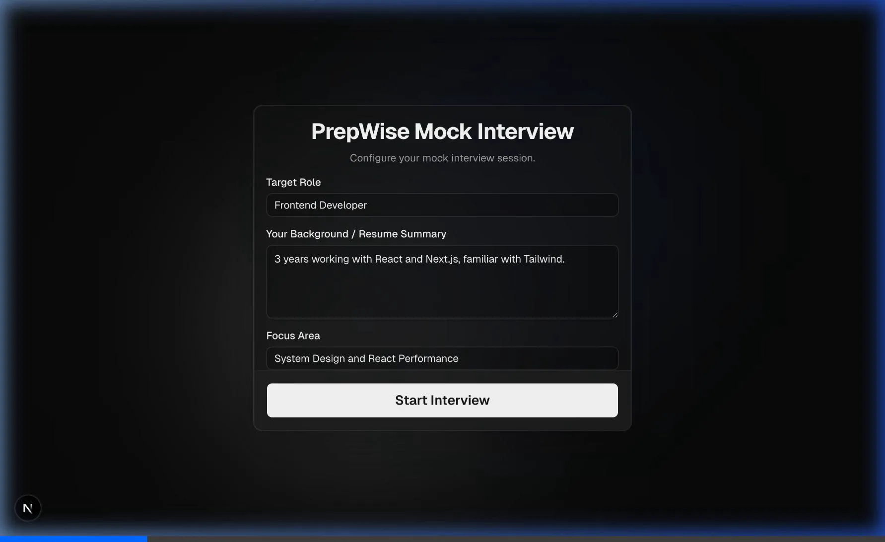

# PrepWise: A Multi-Agent Mock Interview System

PrepWise is a full-stack, serverless web application built with Next.js (App Router), Tailwind CSS, Shadcn/UI, and the Google Generative AI (Gemini) SDK. It acts as an interactive Mock Interview platform that adapts to the candidate's responses in real-time.



---

## 🏗️ Architecture Overview

The magic behind this application lies in its **Multi-Agent Orchestration**, handled entirely serverless within Next.js. Instead of a single AI prompt, the system coordinates three distinct AI personas to create a highly realistic interview.

### What Each Agent Does

Prompts live in `prompts/` at the project root:

| Agent | File | Role |
| :--- | :--- | :--- |
| **Interviewer** | `interviewer.ts` | Conducts the live Q&A. Asks one question per turn, adapts to the candidate's last answer (probes weak answers, advances after strong ones, gracefully pivots on "I don't know"). |
| **Evaluator** | `evaluator.ts` | The "Shadow Agent". Runs silently after every candidate answer. Outputs structured JSON analyzing the response (strengths, gaps, vagueness detected, suggested follow-ups). |
| **Coach** | `coach.ts` | Runs after the interview ends. Consumes the full transcript + evaluator JSON array and outputs a comprehensive Markdown report with strengths, gaps, and an action plan. |

### How They Are Orchestrated

Orchestration is explicit and deterministic, handled by `src/app/api/orchestrator/route.ts`:
- **POST `/api/orchestrator`:** Accepts the user's latest message, the conversation history, and the current turn.
- If `turn < 7`: Calls the **Evaluator** first to generate JSON notes. It then passes the user's message *and* the JSON notes to the **Interviewer** to generate the next response.
- If `turn >= 7`: Calls the **Coach** agent with the entire transcript and all aggregated Evaluator notes to generate final feedback.

---

## 🧠 Key Design Decisions and Tradeoffs

| Decision | Rationale | Tradeoff |
| :--- | :--- | :--- |
| **Serverless Next.js (No Docker/DB)** | Eliminates database bottlenecks; state is managed via React client-side context. Allows trivial horizontal scaling on platforms like Vercel. | Chat history is lost if the page is refreshed. Not suitable if persistent user accounts are needed. |
| **Three Separate Agents** | Interviewer stays "in character"; Evaluator stays cold and analytical; Coach stays supportive. Avoids confusing a single model. | Requires sequential LLM calls (Evaluator -> Interviewer) per turn, adding slight latency. |
| **Gemini 2.5 Flash** | Extremely fast TTFB (Time to First Byte) to mitigate the latency of the sequential dual-agent calls. | Slightly less reasoning capability than Pro models, mitigated by strict prompt constraints. |
| **Framer Motion "Thinking" State** | Masks the network latency of the sequential calls by providing immediate, premium visual feedback to the user. | Adds slight frontend bundle weight. |

---

## 💬 Example Interview Transcripts

*(Illustrative only. Format: MODEL: / USER:)*

### Example A — Strong Candidate
**Target role:** Frontend Developer · **Focus:** System Design

**MODEL:** Let's discuss performance. Walk me through a time you had to optimize the load time of a React application. What metrics did you look at?
**USER:** I worked on a dashboard that was taking 4 seconds to load. I used Chrome DevTools and Lighthouse to identify that a massive D3.js chart component was blocking the main thread. I implemented React.lazy to code-split the chart so it only loaded when the user scrolled to it, dropping our LCP (Largest Contentful Paint) down to 1.2 seconds.
**MODEL:** Excellent approach with code-splitting. If that dashboard also had real-time data streaming via WebSockets, how would you prevent the entire React tree from re-rendering on every tick?
**USER:** I would extract the real-time data into a localized Zustand store and bind only the specific chart component to that store subscription, completely bypassing the React Context API and parent re-renders.

### Example B — Weak Candidate (Vague)
**Target role:** Product Manager · **Focus:** Behavioral

**MODEL:** Tell me about a time you had to say "no" to a major feature request from a key stakeholder.
**USER:** I just explained that we didn't have the bandwidth and they eventually understood.
**MODEL:** Could you be more specific? Who was the stakeholder, what was the feature, and what data did you use to justify saying no?
**USER:** It was the sales team. They wanted a new button. I said no because engineering was busy.
**MODEL:** If the sales team escalated this to the CEO and said it would cost us a major deal, how would you defend your prioritization?

---

## 🚀 Setup and Run Instructions

### Prerequisites
- Node.js (v18+)
- A [Google AI Studio API Key](https://aistudio.google.com/app/apikey)

### Local Development

1. **Clone the repository and install dependencies:**
   ```bash
   npm install
   ```

2. **Configure Environment:**
   Copy `.env.example` to `.env.local` and set your key:
   ```bash
   GEMINI_API_KEY=your_actual_key_here
   ```

3. **Start the Next.js Server:**
   ```bash
   npm run dev
   ```
4. Open [http://localhost:3000](http://localhost:3000).

---

## 🌐 Deploying to Production

Because this project uses the Next.js App Router and keeps state on the client, it is incredibly easy to deploy globally.

### Deploy on Vercel (Recommended)
The easiest way to deploy is using [Vercel](https://vercel.com/):
1. Push your code to a GitHub repository.
2. Go to Vercel, click **Add New Project**, and import your repository.
3. In the **Environment Variables** section, add your `GEMINI_API_KEY`.
4. Click **Deploy**. Vercel will automatically configure the build settings.

### Deploy on Netlify
1. Push your code to a GitHub repository.
2. Go to Netlify, click **Add new site**, and select your repo.
3. Set the build command to `npm run build` and publish directory to `.next`.
4. Add your `GEMINI_API_KEY` in the Environment Variables step.
5. Click **Deploy**.
